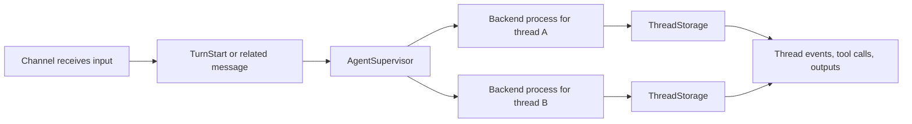

## Overview

This page is for engineers who want to understand how `meshagent process` maps to the implementation.

At a high level, the runtime works like this:

- channels convert outside inputs into process messages
- a supervisor routes those process messages by their resolved thread path
- a configured backend creates one process for each active thread
- thread storage writes runtime events back into the persisted thread model

This gives you one process-backed agent that can accept several channels without collapsing unrelated work into one shared live context.

## What `meshagent process` actually builds

At the CLI level, `meshagent process` is a command group. In the current implementation, that command group reuses the chatbot command implementation and switches it into the `process` runtime mode.

When you run `meshagent process`, the CLI builds:

- one `SingleRoomAgent`
- zero or one `ChatChannel`
- zero or more `MailChannel` instances
- zero or more `QueueChannel` instances
- zero or more `ToolkitChannel` instances
- one `AgentSupervisor`
- one or more configured backends, such as `LLMBackend` or `CodexBackend`
- one backend-created process per active thread
- one `ThreadStorage` instance per persisted active thread

That layering matters because `process` is not a single SDK class called "ProcessAgent". It is a runtime assembly of channels plus per-thread execution.

## Runtime flow

In practice:

1. a channel receives input from chat, mail, a queue, or a toolkit invocation
2. the channel emits process messages, including the resolved thread path on `thread_id`
3. the supervisor selects the configured backend for the thread
4. the backend finds or creates the process for that thread
5. the thread-scoped process runs the turn
6. thread storage records outputs, lifecycle state, tool activity, and status into the thread model

## Channel responsibilities

A channel has one job:

- receive input from some source
- convert it into process messages
- emit those messages into the supervisor

That makes channels the extension point for new integrations.

The built-in channel types are:

- `ChatChannel`
- `MailChannel`
- `QueueChannel`
- `ToolkitChannel`

If you want to add another surface, such as Slack, the process model is to add another channel adapter that turns Slack events into process messages.

## What `AgentSupervisor` does

`AgentSupervisor` is the router for the runtime.

Its main responsibilities are to:

- hold the active channels for the runtime
- accept messages emitted by those channels
- route those messages to the correct thread process
- create a new process when a thread is seen for the first time
- start and stop managed processes as the runtime lifecycle changes

If you are looking for the place where work becomes thread-scoped, this is it. The supervisor is the boundary between "one long-running process-backed agent" and "per-thread execution".

## Channel roles

The built-in channels each adapt a different source of input:

- `ChatChannel`: bridges room messages and thread-oriented chat interfaces
- `MailChannel`: turns inbound mail into turns and sends the resulting reply back through the mailbox flow
- `QueueChannel`: listens on a room queue and turns queue payloads into agent turns
- `ToolkitChannel`: exposes the agent as a callable toolkit so other participants can send a prompt and receive a reply

## What a backend process does

The backend process is the thread-level execution loop for turns.

Each instance handles one active thread at a time and is responsible for:

- receiving routed messages for that thread
- running the agent logic
- managing turn lifecycle events
- coordinating tool calls and approvals
- emitting outputs back to the channels and thread storage

This is why one process-backed agent can serve many channels and many threads without mixing unrelated thread state together.

## Backend implementations

A backend decides what kind of thread process gets created after a channel delivers a turn.

| Backend | Selected with | Thread process | What it does |
| --- | --- | --- | --- |
| LLM | `--model gpt-5.5` or another standard model | `LLMAgentProcess` | Runs the turn through MeshAgent's LLM adapters, including tool calls, streaming, and model/provider selection. |
| Codex | `--backend codex` or `--model codex/...` | `CodexAgentProcess` | Runs the turn through Codex app-server while MeshAgent keeps the room participant, channels, routing, and thread storage. |

Most application agents should use the LLM backend. Use the Codex backend when you want the same room participant, channel, routing, deployment, and thread-storage model, but you want Codex to execute the turns.

## Per-thread routing and queueing

The supervisor routes by the process-message `thread_id` field, which contains the resolved thread path, and creates a thread process on first use.

This matters for two reasons:

- messages for the same thread go to the same backend process
- unrelated threads do not share one live execution state

In practice, this is what prevents turns on the same thread from stepping on each other while still letting one process-backed agent serve many threads.

## Local memory channel

`meshagent process run` can also use a `memory` channel. This is separate from the Memories toolkit.

- `--channel memory` is a local process-run channel used by the CLI's interactive process session.
- `meshagent process run` defaults to the memory channel when no channel is provided.
- `--no-room` uses that path to run locally without connecting to a room.
- `--use-memory <name-or-path>` is different: it adds the room-backed Memories toolkit to the agent.

Use `--channel chat` when the agent should be reachable from room chat in Studio or Powerboards. Use the memory channel when you want a local interactive process run that does not need room chat.

## Streaming and live turn state

The process runtime does not just wait for a final answer. It emits incremental state as a turn progresses.

That includes:

- text deltas
- file output updates
- reasoning summary updates
- tool call progress and logs
- turn lifecycle events such as started, completed, failed, or interrupted

Those updates are written into the thread model so UIs and other clients can reflect what is happening while the turn is still running.

## Approvals, steering, and interrupts

Process also handles live control flows around an active turn:

- tool calls can pause and wait for approval
- turns can be steered with additional input
- turns can be interrupted and resumed or cancelled

These are runtime features, not channel-specific hacks. Channels deliver the messages, and the process runtime handles them in a thread-aware way.

This is part of what makes process-backed agents useful for coding, research, and other longer-running workflows.

## What thread storage does

`ThreadStorage` is the bridge between the process runtime and the persisted thread representation.

It is responsible for turning process events into thread updates such as:

- messages and content items
- tool call state
- status updates
- turn lifecycle data

This keeps the process runtime aligned with the same thread model used elsewhere in MeshAgent.

It also maintains per-thread status and pending-message metadata so clients can show whether a thread is thinking, waiting for approval, or ready to be steered.

## Context isolation

The important rule is:

- **context isolation is by thread path, not by process**

That means one process-backed agent can accept input from several channels without automatically mixing those histories together. Context only overlaps when two inputs use the same thread path.

## Adapter-provided model behavior

Some behavior comes from the configured LLM adapter rather than from the process runtime itself.

For example, streaming model events and reasoning summaries are surfaced through the process runtime, but capabilities such as automatic context compaction depend on whether the selected adapter supports them.

## Where to go next

- [Process Agents Overview](./overview): when to choose `process`
- [Agent Turns](./agent_turns): the product-facing turn lifecycle model
- [Threads Overview](../threads_overview): the persistence model process agents build on
