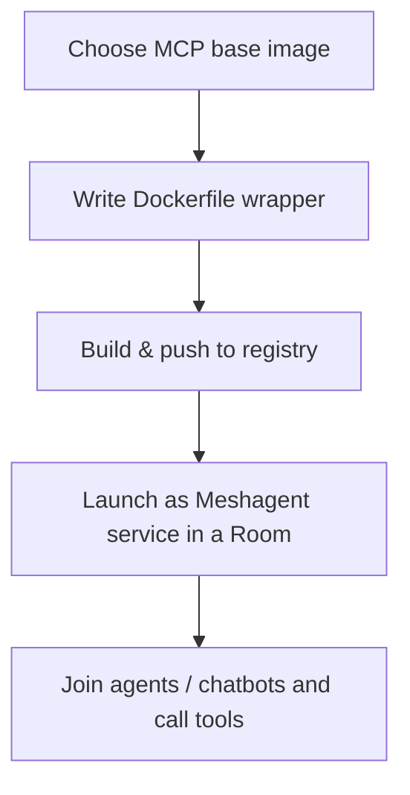

> **Purpose**: This guide shows you how to take any *Model‑Context Protocol* (MCP) server image and "wrap" it with Meshagent so the server can be launched as a **service** inside a Meshagent Room and then accessed by agents, chatbots, or external callers.

---

## 1. Why Wrap an MCP Image?

Meshagent Rooms are collaborative sandboxes where multiple AI agents (and humans) share **toolkits**—self‑contained HTTP services that expose standardized JSON tools.  An MCP server *already* implements the toolkit spec, but it lacks the Room‑level plumbing:

| Layer                                | What It Adds                                                                                 |
| ------------------------------------ | -------------------------------------------------------------------------------------------- |
| **MCP Base Image**                   | Implements your domain logic and OpenAPI spec                                                |
| **Meshagent Wrapper**                | • Starts Meshagent’s [`mcp stdio-service`](https://docs.meshagent.com/agents/standard/intro) |
| • Proxies HTTP ↔ stdin/stdout        |                                                                                              |
| • Handles Room auth, health, logging |                                                                                              |

Wrapping therefore lets **any** MCP server be hot‑plugged into a Room with *zero* application changes.

---

## 2. High‑Level Workflow



1. **Pick a base**: e.g. `mcp/3d-printer` from Docker Hub.
2. **Write a one‑page Dockerfile** (see §3).
3. **Build & tag**: `docker build -t meshagent/mcp-3d-printer:latest .`.
4. **Push** to a registry Meshagent can pull from.
5. **Launch** with `meshagent service`.
6. **Interact** via chatbot or API.

---

## 3. Reference Dockerfile

```dockerfile
# 1️⃣  Start from an official MCP server image
FROM mcp/3d-printer

# 2️⃣  Declare how the underlying MCP server is normally started
ENV PARENT_ENTRYPOINT="node dist/index.js"

# 3️⃣  Tell Meshagent which port to expose
ENV MESHAGENT_PORT=8000

# (Optional) Name the toolkit for nice UX in the Room
ENV TOOLKIT_NAME="3d-printer"

# 4️⃣  Install Python + Meshagent inside a dedicated venv
WORKDIR /app
USER root
RUN apk add --no-cache python3 py3-virtualenv py3-pip \
    && ln -sf python3 /usr/bin/python \
    && ln -sf pip3 /usr/bin/pip

ARG MESHAGENT_VERSION=0.0.28
ENV PIP_NO_CACHE_DIR=1
RUN python3 -m venv /p3/.venv \
    && . /p3/.venv/bin/activate \
    && pip install "meshagent[mcp-service]==$MESHAGENT_VERSION"
ENV PATH="/p3/.venv/bin:$PATH"

# 5️⃣  Expose the chosen port
EXPOSE $MESHAGENT_PORT

# 6️⃣  Drop back to non‑root for security
USER user

# 7️⃣  Launch Meshagent, which in turn execs the original MCP entrypoint
ENTRYPOINT ["/bin/sh","-c","
  echo \"[Container] Starting $TOOLKIT_NAME with meshagent stdio-service on port $MESHAGENT_PORT → path /webhook\"; \
  exec meshagent mcp stdio-service \
     --port=$MESHAGENT_PORT --path=/webhook --toolkit-name=\"$TOOLKIT_NAME\" \
     --command=\"$PARENT_ENTRYPOINT\" \
"]
```

> **Key points**
>
> * `meshagent mcp stdio-service` converts stdin/stdout ↔ HTTP.
> * `--path=/webhook` is Meshagent’s default webhook path for MCP traffic.
> * The wrapper stays *thin*—no changes to the underlying server code.

---

## 4. Build & Push

```bash
# Build the image
$ docker build -t meshagent/mcp-3d-printer:latest .

# Push to Docker Hub (or your private registry)
$ docker push meshagent/mcp-3d-printer:latest
```

\:::tip Private registries
If you use a private registry, configure a [Meshagent Pull Secret](https://docs.meshagent.com/cli/pull_secrets) so the Room can fetch the image.
\:::

---

## 5. Launching in a Room

```bash
meshagent service test \
  --room=test \
  --role=agent \
  --image=meshagent/mcp-3d-printer:latest \
  --env MESHAGENT_PORT=8000 \
  --port="num=8000 path=/webhook liveness=/ type=meshagent.callable" \
  --name=mcp-3d-printer-service
```

* `--room` creates (or re‑uses) a named Room.
* `--port` maps *container* port 8000 to a **callable** toolkit endpoint within the Room.
* After a few seconds the toolkit appears in the Room UI and via API.

---

## 6. Interacting from an Agent

```bash
meshagent chatbot join \
  --room=test \
  --agent-name=sample \
  --toolkit=mcp-3d-printer
```

The chatbot (or any agent SDK) can now call the MCP tools—e.g. `print_3d_model`, `list_printers`, etc.—through standard Meshagent JSON‑RPC messages.

---

## 7. Debugging & Logs

| Symptom                                               | Fix                                                              |
| ----------------------------------------------------- | ---------------------------------------------------------------- |
| **Toolkit never appears**                             | • Check `meshagent service ...` logs for image‑pull errors       |
| • Verify `--port` path matches `--path` in Dockerfile |                                                                  |
| **HTTP 404 on /webhook**                              | Confirm `--path` flag in ENTRYPOINT and `--port ... path=` agree |
| **Permission errors**                                 | Make sure you switched back to `USER user` after root installs   |
| **Broken pip**                                        | Add `RUN apk add gcc musl-dev` if native wheels need compiling   |

---

## 8. Best Practices

1. **Pin Meshagent version** (`ARG MESHAGENT_VERSION`) to avoid surprises.
2. **Keep wrapper lean**—no extra packages beyond Python & Meshagent.
3. **Use non‑root** user for runtime security.
4. **Expose health endpoints** (`liveness=/`) for production Rooms.
5. **Document env vars** (`README.md`, labels) so users know what to set.
6. **Automate builds** with CI to push `:latest` and semver tags.

---

## 9. Further Reading

* Meshagent CLI **Getting Started**: [https://docs.meshagent.com/cli/getting_started](https://docs.meshagent.com/cli/getting_started)
* Meshagent **StdIO Service** spec: [https://docs.meshagent.com/agents/standard/intro](https://docs.meshagent.com/agents/standard/intro)
* Meshagent **Room API**: [https://docs.meshagent.com/room\_api/overview](https://docs.meshagent.com/room_api/overview)
* Example **Brave Search Toolkit**: [https://hub.docker.com/r/meshagent/mcp-brave-search](https://hub.docker.com/r/meshagent/mcp-brave-search)
* MCP Server Template repo: [https://github.com/modelcontextprotocol/servers](https://github.com/modelcontextprotocol/servers)

---

### Quick‑Reference Checklist

* [ ] MCP base image chosen
* [ ] `PARENT_ENTRYPOINT` set
* [ ] `MESHAGENT_PORT` exposed
* [ ] Meshagent installed in venv
* [ ] ENTRYPOINT execs `meshagent mcp stdio-service`
* [ ] Image built & pushed to registry
* [ ] Service launched with `meshagent service ...`
* [ ] Toolkit visible in Room

*Happy wrapping!*
